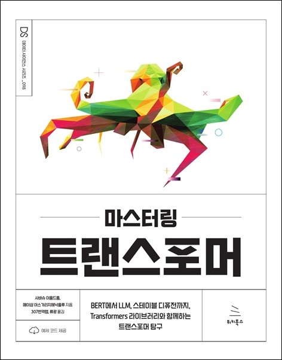

# 마스터링 트랜스포머
### BERT에서 LLM, 스테이블 디퓨전까지, Transformers 라이브러리와 함께하는 트랜스포머 탐구

- **사바슈 이을드름, 메이삼 아스가리지헤낙흘루** 지음 | **307번역랩, 류광** 옮김
- ISBN: 9791158395636
- 판형: 188\*240\*20mm
- 35,000원 | 2025년 1월 10일 발행 | 504쪽
- [책 홈페이지](https://wikibook.co.kr/transformer/)
- [도서 미리보기](http://www.yes24.com/Product/Viewer/Preview/141128416)
- [도서 관련 문의](https://wikibook.co.kr/support/contact/)

---

**트랜스포머 기반 언어 모델을 살펴보고 NLP 및 컴퓨터비전 작업을 탐구하면서 문제를 효과적으로 해결해 보자!**

BERT, T5, GPT, DALL-E, ChatGPT 같은 트랜스포머 기반 언어 모델이 자연어 처리(NLP) 연구를 주도하며 새로운 패러다임을 형성하고 있다. 정확하고 빠른 미세조정 능력 덕분에 이 모델들은 까다로운 자연어 이해(NLU) 문제에서 전통적인 머신러닝 기반 접근 방식을 능가하는 성능을 보여준다.

트랜스포머는 NLP뿐만 아니라 현재 빠르게 성장 중인 다중 모달 학습과 생성형 AI 분야에서도 주목할 만한 성과를 내고 있다. 이 책을 통해 독자는 다양한 텍스트 기반 NLP 작업은 물론이고 텍스트-이미지 변환을 포함한 다중 모달 솔루션과 트랜스포머 기반 컴퓨터비전(CV) 솔루션도 익히고 구현할 수 있다. 이 책은 먼저 다양한 트랜스포머 모델을 소개하고, GPT나 XLNet 같은 자기회귀 언어 모델을 훈련하는 방법을 설명한다. 모델의 성능을 개선하는 방법과 텐서보드(TensorBoard) 도구모음을 이용해서 모델 훈련 과정을 추적하는 방법도 익힐 수 있다. 책의 후반부에서는 비전 트랜스포머(ViT)를 활용해 컴퓨터비전 문제를 해결하는 데 초점을 맞춘다. 마지막으로는 트랜스포머의 능력을 시계열 데이터의 모델링과 예측에 적용하는 방법을 살펴본다.

이 책을 통해 독자는 트랜스포머 모델을 이해하고, NLP와 컴퓨터비전 분야의 여러 작업을 트랜스포머로 해결하는 방법을 터득하게 될 것이다.

**★ 이 책에서 다루는 내용 ★**

- 간단하거나 복잡한 여러 NLP 문제를 파이썬을 이용해서 해결하는 데 집중한다.
- 전통적인 NLP 접근 방식으로 분류/회귀 문제를 해결하는 방법을 익힌다.
- 언어 모델을 학습시키고 하위 작업에 맞게 미세조정하는 방법을 이해한다.
- 생성형 AI와 컴퓨터 비전 작업에 트랜스포머를 활용하는 방법을 익힌다.
- 허깅 페이스의 Transformers 라이브러리를 이용해 트랜스포머 기반 NLP 앱을 구축한다.
- 기계번역과 대화형 AI 등 다국어 언어 생성 작업을 수행한다.
- 트랜스포머 모델의 추론 속도를 높이고 지연 시간을 단축하기 위한 효율성 개선 기법을 설명한다.

---
 
 ## 구입처
 
 - [예스24](https://www.yes24.com/Product/Goods/141128416)
 - [교보문고](https://product.kyobobook.co.kr/detail/S000215102436)
 - [알라딘](https://www.aladin.co.kr/shop/wproduct.aspx?ItemId=354943663)
 - [쿠팡](https://www.coupang.com/vp/products/8533805082?itemId=24702925754)